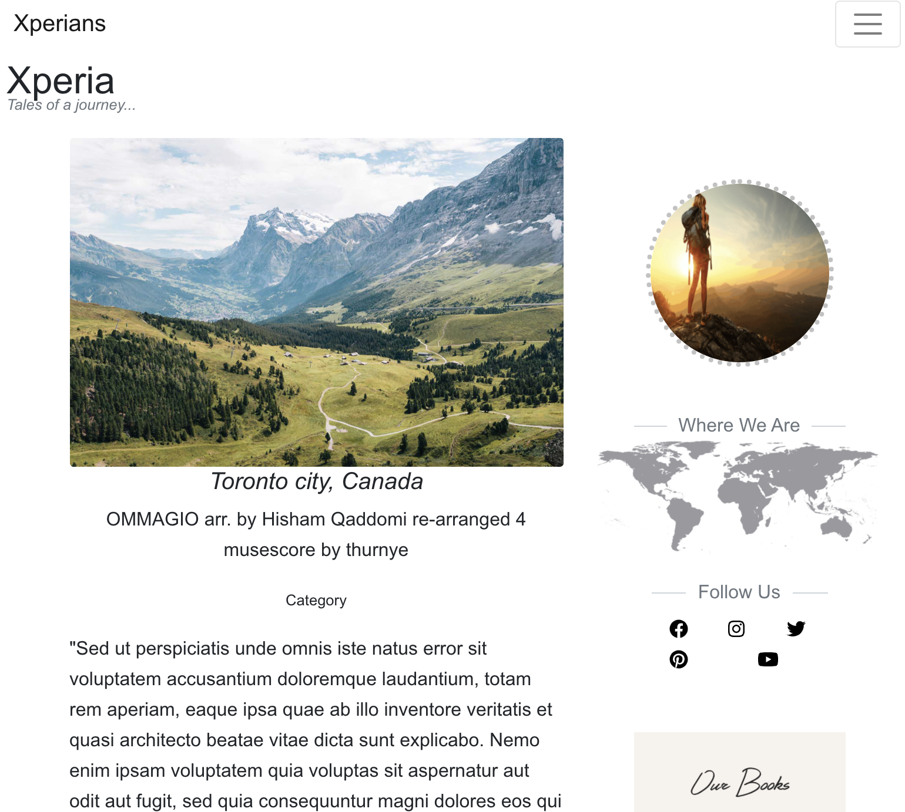

## Xperia

Have you wanted to travel to a city and dont really know what the experience would be like?, dont worry this app got you covered. Xperia is a wonderful place to get started by grabbing explorers experiences around the world to guide your path on your new journey.

| Technology | Use |
| --- | --- |
| ReactJs |Front End  |
| NodeJs | BackEnd |
| MongoDB | DataBase |
| Bootstrap | Design and Layout |
| FontAwesome | Icons |

To run local
### `add a .env file in the root repo and added your database connection string`
### `npm i`
### `npm start

Runs the app in the development mode. 
[Delpoyed Site](https://x-peria-app.herokuapp.com/) for more information.

