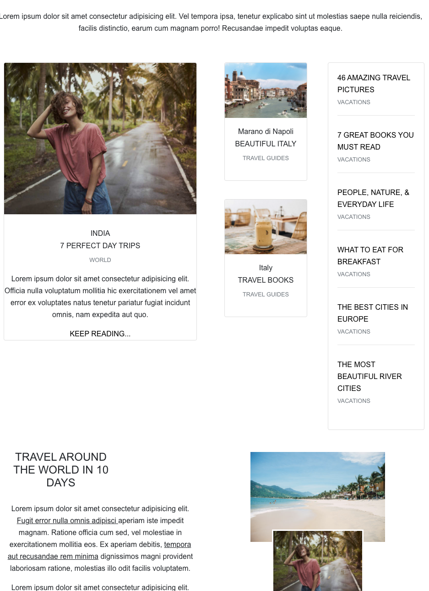

## Xperia

Have you wanted to travel to a city and dont really know what the experience would be like?, dont worry this app got you covered. Xperia is a wonderful place to get started by grabbing explorers experiences around the world to guide your path on your new journey.

| Technology | Use |
| --- | --- |
| ReactJs |Front End  |
| NodeJs | BackEnd |
| MongoDB | DataBase |
| Bootstrap | Design and Layout |
| FontAwesome | Icons |

### `npm install`
### `npm start`

Runs the app in the development mode. 
Open [http://localhost:3000] for th client side
(http://localhost:8000) for the server side

To connect to the database - MongoDB
add a .env file in the root repo and added your database connection string

### `npm test`

Launches the test runner in the interactive watch mode. 
See the section about [running tests](https://facebook.github.io/create-react-app/docs/running-tests) for more information.

### `npm run build`
 if to send to production